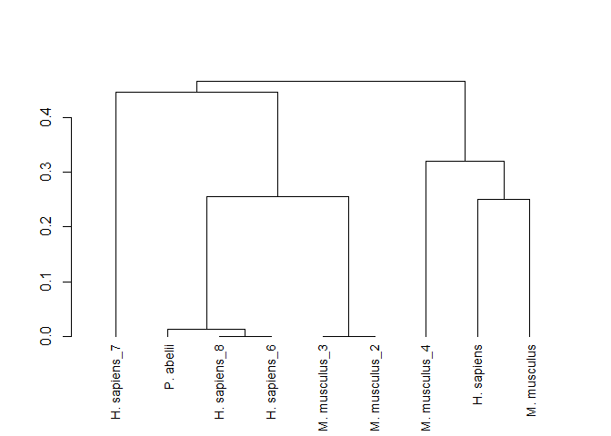
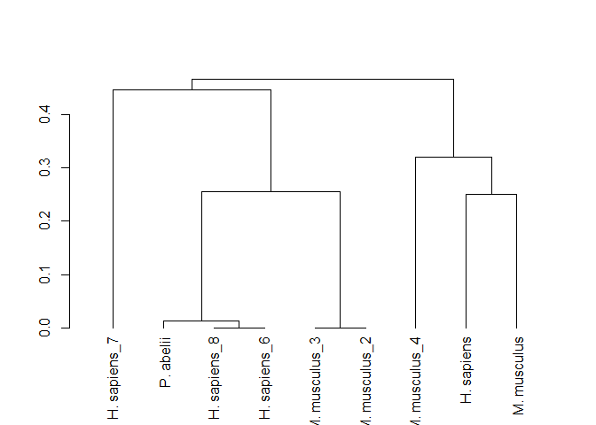
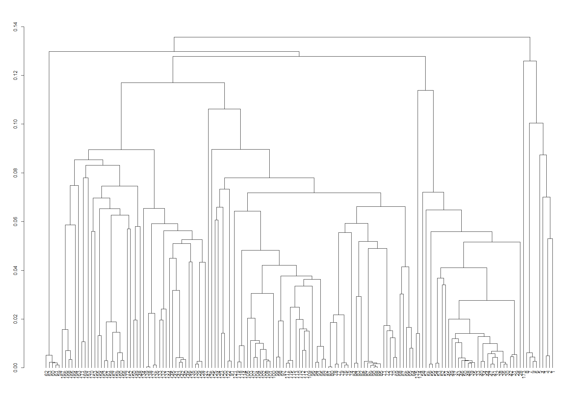

# Introduction
 
Learn:

 - How to perform multiple alignment
 - How to build graphs for alignment
 - How to build a fylogenetic tree
 - How and why to build `DNAStringset` and `AAStringSet` objects
 - Appply sequence alignment in `{DECIPHER}` package on a new dataset
 
# Packages

```r
library(msa)
library(tidyverse)
library(biomaRt)
library(annotate)
library(Biostrings)
library(seqinr)
# install.packages('msaR')
library(DECIPHER)
```

# Vignettes

```r
browseVignettes("msaR")
browseVignettes("DECIPHER")
system.file("tex", "texshade.sty", package="msa")
```

# Theory
Sequence alignment is important tool to investigate structural, evolutionary and mechanistical simularities in (biological) strings. 

One algorithm used to score alignment of strings is the `Needleman-Wunsch` algorithm. 

The exect details of the algorithm are out of scope for this lesson. Wikipedia ia good source for details: https://en.wikipedia.org/wiki/Needleman%E2%80%93Wunsch_algorithm

# Data
Remember the data with the homolog sequences for Caspase-3, -4 and -5 from Human, Orang Utan and Mouse?
We will use it here to learn how to use Bioconductor to do multiple sequence alignments.


```r
example_caspase <- read_rds(path = file.path(root, "data", "biomaRt_homology_example_aa.rds"))
example_caspase_dna <- read_rds(path = file.path(root, "data", "biomaRt_homology_example_dna.rds"))
```

# Filter for Caspase-4
For example sake we use the sequences for Caspase-4 only. To select the right caspases, we need to convert to lower case for all the symbol names

```r
example_caspase$external_gene_name <- tolower(example_caspase$external_gene_name) 
levels(as.factor(example_caspase$external_gene_name))
```

```
## [1] "casp3" "casp4" "casp5"
```

```r
casp4 <- example_caspase %>%
  filter(external_gene_name == "casp4")
casp4
```

```
## # A tibble: 7 x 4
##   amino_acid_sequence                 ensembl_gene_id  external_gene_n~ species 
##   <chr>                               <chr>            <chr>            <chr>   
## 1 MADAMKKKHSKVGEMLLQTFFSVDPGSHHGEANL~ ENSMUSG00000033~ casp4            M. musc~
## 2 MAENKHPDKPLKVLEQLGKEVLTEYLEKLVQSNV~ ENSMUSG00000033~ casp4            M. musc~
## 3 MAENKHPDKPLKVLEQLGKEVLTEYLEKLVQSNV~ ENSMUSG00000033~ casp4            M. musc~
## 4 MADSMQEKQRMAGQMLLQTFFNIDQISPNKKAHP~ ENSG00000196954  casp4            H. sapi~
## 5 MAEGNHRKKPLKVLESLGKDFLTGVLDNLVEQNV~ ENSG00000196954  casp4            H. sapi~
## 6 MAEGNHRKKPLKVLESLGKDFLTGVLDNLVEQNV~ ENSG00000196954  casp4            H. sapi~
## 7 MAEGNHRKKPLKMLESLGKDFLTGVLDNLVEQNV~ ENSPPYG00000003~ casp4            P. abel~
```

# AAStringSet

```r
caspase_aa <- Biostrings::AAStringSet(casp4$amino_acid_sequence)
caspase_aa
```

```
##   A AAStringSet instance of length 7
##     width seq
## [1]    93 MADAMKKKHSKVGEMLLQTFFSVDPGSHHGEANL...KTQEIYPIKEANGRTRKALIICNTEFKHLSLRY
## [2]   374 MAENKHPDKPLKVLEQLGKEVLTEYLEKLVQSNV...VQQSFEKASIHSQMPTIDRATLTRYFYLFPGN*
## [3]   119 MAENKHPDKPLKVLEQLGKEVLTEYLEKLVQSNV...EDLPNKGGQWPYTKGSYHMQYRVQTSLTEVWG*
## [4]   322 MADSMQEKQRMAGQMLLQTFFNIDQISPNKKAHP...VQQSFETPRAKAQMPTIERLSMTRYFYLFPGN*
## [5]   378 MAEGNHRKKPLKVLESLGKDFLTGVLDNLVEQNV...VQQSFETPRAKAQMPTIERLSMTRYFYLFPGN*
## [6]   147 MAEGNHRKKPLKVLESLGKDFLTGVLDNLVEQNV...LRLCKERAEEIYPIKERNNRTRLALIICNTEFD
## [7]   378 MAEGNHRKKPLKMLESLGKDFLTGVLDNLVEQNV...VQQSFETPRAKAQMPTIERLSMTRYFYLFPGN*
```

```r
typeof(caspase_aa)
```

```
## [1] "S4"
```

```r
caspase_aa[[1]][1:10]
```

```
##   10-letter "AAString" instance
## seq: MADAMKKKHS
```

# Set names to AAStringSet sequences

```r
names(caspase_aa) <- paste(casp4$species, casp4$ensembl_gene_id, sep = "_")
#duplicated(casp5$coding[1:42])
caspase_aa
```

```
##   A AAStringSet instance of length 7
##     width seq                                               names               
## [1]    93 MADAMKKKHSKVGEMLLQTFFSV...ANGRTRKALIICNTEFKHLSLRY M. musculus_ENSMU...
## [2]   374 MAENKHPDKPLKVLEQLGKEVLT...HSQMPTIDRATLTRYFYLFPGN* M. musculus_ENSMU...
## [3]   119 MAENKHPDKPLKVLEQLGKEVLT...PYTKGSYHMQYRVQTSLTEVWG* M. musculus_ENSMU...
## [4]   322 MADSMQEKQRMAGQMLLQTFFNI...KAQMPTIERLSMTRYFYLFPGN* H. sapiens_ENSG00...
## [5]   378 MAEGNHRKKPLKVLESLGKDFLT...KAQMPTIERLSMTRYFYLFPGN* H. sapiens_ENSG00...
## [6]   147 MAEGNHRKKPLKVLESLGKDFLT...IYPIKERNNRTRLALIICNTEFD H. sapiens_ENSG00...
## [7]   378 MAEGNHRKKPLKMLESLGKDFLT...KAQMPTIERLSMTRYFYLFPGN* P. abelii_ENSPPYG...
```

# Aligment of sequences, using the {msa} package

# Using the `{msa}` package

```r
library(msa)

caspase_align <- msa::msa(caspase_aa)
```

```
## use default substitution matrix
```

```r
caspase_align
```

```
## CLUSTAL 2.1  
## 
## Call:
##    msa::msa(caspase_aa)
## 
## MsaAAMultipleAlignment with 7 rows and 430 columns
##     aln                                                    names
## [1] MAEGNHRKKPLKVLESLGKDFLTGVL...------------------------- H. sapiens_ENSG00...
## [2] MAEGNHRKKPLKMLESLGKDFLTGVL...RAKAQMPTIERLSMTRYFYLFPGN- P. abelii_ENSPPYG...
## [3] --------------------------...RAKAQMPTIERLSMTRYFYLFPGN- H. sapiens_ENSG00...
## [4] MAEGNHRKKPLKVLESLGKDFLTGVL...RAKAQMPTIERLSMTRYFYLFPGN- H. sapiens_ENSG00...
## [5] --------------------------...SIHSQMPTIDRATLTRYFYLFPGN- M. musculus_ENSMU...
## [6] --------------------------...------------------------- M. musculus_ENSMU...
## [7] --------------------------...------------------------- M. musculus_ENSMU...
## Con --------------------------...????QMPTI?R???TRYFYLFPGN- Consensus
```


# Print alignment

```r
print(caspase_align, show="complete")
```

```
## 
## MsaAAMultipleAlignment with 7 rows and 430 columns
##     aln (1..54)                                            names
## [1] MAEGNHRKKPLKVLESLGKDFLTGVLDNLVEQNVLNWKEEEKKKYYDAKTEDKV H. sapiens_ENSG00...
## [2] MAEGNHRKKPLKMLESLGKDFLTGVLDNLVEQNVLNWKEEEKKKYYDAKTEDKV P. abelii_ENSPPYG...
## [3] ------------------------------------------------------ H. sapiens_ENSG00...
## [4] MAEGNHRKKPLKVLESLGKDFLTGVLDNLVEQNVLNWKEEEKKKYYDAKTEDKV H. sapiens_ENSG00...
## [5] ------------------------------------------------------ M. musculus_ENSMU...
## [6] ------------------------------------------------------ M. musculus_ENSMU...
## [7] ------------------------------------------------------ M. musculus_ENSMU...
## Con ------------------------------------------------------ Consensus 
## 
##     aln (55..108)                                          names
## [1] RVMADSMQ-EKQRMAGQMLLQTFFNIDQISPNKKAHPNMEAGPPESGESTDALK H. sapiens_ENSG00...
## [2] RVMADSIQ-EKQRMAGQMLLQTFFNIDQISPNKKAHPNMEAGPPESGESTDALK P. abelii_ENSPPYG...
## [3] --MADSMQ-EKQRMAGQMLLQTFFNIDQISPNKKAHPNMEAGPPESGESTDALK H. sapiens_ENSG00...
## [4] RVMADSMQ-EKQRMAGQMLLQTFFNIDQISPNKKAHPNMEAGPPESGESTDALK H. sapiens_ENSG00...
## [5] --MAENKHPDKPLKVLEQLGKEVLTEYLEKLVQSNVLKLKEEDKQKFNNAERSD M. musculus_ENSMU...
## [6] --MAENKHPDKPLKVLEQLGKEVLTEYLEKLVQSNVLKLKEEDKQKFNNAERSD M. musculus_ENSMU...
## [7] --MADAMK-KKHSKVGEMLLQTFFSVDPGSHHGEANLEMEEPE-ESLNTLKLCS M. musculus_ENSMU...
## Con --MADSMQ-EKQRMAGQMLLQTFFNIDQISPNKKAHPNMEAGPPESGESTDALK Consensus 
## 
##     aln (109..162)                                         names
## [1] LCP------HEEFLRLCKERAEEIYPIKERNNRTRLALIICNTEFD-------- H. sapiens_ENSG00...
## [2] LCP------HEEFLRLCKERAEEIYPIKERNNRTRLALIICNTEFDHLPPRNGA P. abelii_ENSPPYG...
## [3] LCP------HEEFLRLCKERAEEIYPIKERNNRTRLALIICNTEFDHLPPRNGA H. sapiens_ENSG00...
## [4] LCP------HEEFLRLCKERAEEIYPIKERNNRTRLALIICNTEFDHLPPRNGA H. sapiens_ENSG00...
## [5] KRWVFVDAMKKKHSKVGEMLLQTFFSVDPGSHHGEANLEMEEPEESLNTLKLCS M. musculus_ENSMU...
## [6] KRWVFVDAMKKKHSKVGEMLLQTFFSVDPGSHHG-------------------- M. musculus_ENSMU...
## [7] P---------EEFTRLCREKTQEIYPIKEANGRT-------------------- M. musculus_ENSMU...
## Con LCP------HEEFLRLCKERAEEIYPIKERNNRTRLALIICNTEFD???????? Consensus 
## 
##     aln (163..216)                                         names
## [1] ------------------------------------------------------ H. sapiens_ENSG00...
## [2] DFDITG---------------------------------------------MKE P. abelii_ENSPPYG...
## [3] DFDITG---------------------------------------------MKE H. sapiens_ENSG00...
## [4] DFDITG---------------------------------------------MKE H. sapiens_ENSG00...
## [5] PEEFTRLCREKTQEIYPIKEANGRTRKALIICNTEFKHLSLRYGANFDIIGMKG M. musculus_ENSMU...
## [6] ------------------------------------------------------ M. musculus_ENSMU...
## [7] ------------------------------------------------------ M. musculus_ENSMU...
## Con ????T?---------------------------------------------MK? Consensus 
## 
##     aln (217..270)                                         names
## [1] ------------------------------------------------------ H. sapiens_ENSG00...
## [2] LLEGLDYSVDVEENLTARDMESALRAFAARPEHKSSDSTFLVLMSHGILEGICG P. abelii_ENSPPYG...
## [3] LLEGLDYSVDVEENLTARDMESALRAFATRPEHKSSDSTFLVLMSHGILEGICG H. sapiens_ENSG00...
## [4] LLEGLDYSVDVEENLTARDMESALRAFATRPEHKSSDSTFLVLMSHGILEGICG H. sapiens_ENSG00...
## [5] LLEDLGYDVVVKEELTAEGMESEMKDFAALSEHQTSDSTFLVLMSHGTLHGICG M. musculus_ENSMU...
## [6] --EDL------------------------------------------------- M. musculus_ENSMU...
## [7] ------------------------------------------------------ M. musculus_ENSMU...
## Con LLE?L?Y?V?V?E?LTA??MES????FA???EH??SDSTFLVLMSHG?L?GICG Consensus 
## 
##     aln (271..324)                                         names
## [1] ------------------------------------------------------ H. sapiens_ENSG00...
## [2] TVHDEKKPDVLLYDTIFQIFNNRNCLSLKDKPKVIIVQACRGANRGELWVRDSP P. abelii_ENSPPYG...
## [3] TVHDEKKPDVLLYDTIFQIFNNRNCLSLKDKPKVIIVQACRGANRGELWVRDSP H. sapiens_ENSG00...
## [4] TVHDEKKPDVLLYDTIFQIFNNRNCLSLKDKPKVIIVQACRGANRGELWVRDSP H. sapiens_ENSG00...
## [5] TMHSEKTPDVLQYDTIYQIFNNCHCPGLRDKPKVIIVQACRGGNSGEMWIRESS M. musculus_ENSMU...
## [6] -------------------------P-----------------NKGGQWP---- M. musculus_ENSMU...
## [7] -------------------------------------------RKALII----- M. musculus_ENSMU...
## Con T?H?EK?PDVL?YDTI?QIFNN??C??L?DKPKVIIVQACRG?N?GE?W?R?S? Consensus 
## 
##     aln (325..378)                                         names
## [1] ------------------------------------------------------ H. sapiens_ENSG00...
## [2] ASLEVASSQSPENLEEDAVYKTHVEKDFIAFCSSTPHNVSWRDSTMGSIFITQL P. abelii_ENSPPYG...
## [3] ASLEVASSQSSENLEEDAVYKTHVEKDFIAFCSSTPHNVSWRDSTMGSIFITQL H. sapiens_ENSG00...
## [4] ASLEVASSQSSENLEEDAVYKTHVEKDFIAFCSSTPHNVSWRDSTMGSIFITQL H. sapiens_ENSG00...
## [5] KPQLCRGVDLPRNMEADAVKLSHVEKDFIAFYSTTPHHLSYRDKTGGSYFITRL M. musculus_ENSMU...
## [6] -------------------------------YTKGSYHMQYRVQTS----LTEV M. musculus_ENSMU...
## [7] -------------------------------CNTEFKHLSLRY----------- M. musculus_ENSMU...
## Con ????????????N?E?DAV???HVEKDFIAFCS?TPH??S?RD?T?GS?FIT?L Consensus 
## 
##     aln (379..430)                                       names
## [1] ---------------------------------------------------- H. sapiens_ENSG00...
## [2] ITCFQKYSWCCHLEEVFRKVQQSFETPRAKAQMPTIERLSMTRYFYLFPGN- P. abelii_ENSPPYG...
## [3] ITCFQKYSWCCHLEEVFRKVQQSFETPRAKAQMPTIERLSMTRYFYLFPGN- H. sapiens_ENSG00...
## [4] ITCFQKYSWCCHLEEVFRKVQQSFETPRAKAQMPTIERLSMTRYFYLFPGN- H. sapiens_ENSG00...
## [5] ISCFRKHACSCHLFDIFLKVQQSFEKASIHSQMPTIDRATLTRYFYLFPGN- M. musculus_ENSMU...
## [6] WG-------------------------------------------------- M. musculus_ENSMU...
## [7] ---------------------------------------------------- M. musculus_ENSMU...
## Con I?CF?K????CHL???F?KVQQSFE??????QMPTI?R???TRYFYLFPGN- Consensus
```

# Pretty print aligment

```r
# does not work on my pc
msaPrettyPrint(caspase_align, output="pdf",  y=c(10, 30), showNames="none",
               showLogo="none", askForOverwrite=FALSE, verbose=FALSE)
```

# Alignment using the {DECIPHER} package

# Amino acids


```r
# BiocManager::install("DECIPHER")
library(DECIPHER)
AA <- AlignSeqs(caspase_aa, processors = 8) # align the translation
BrowseSeqs(AA, highlight=1) # view the alignment
```

# Alignment in browser


# Subsetting an alignment
Subsetting an alignment works the same as for ranges.
First we select the sequences that we want subset, using normal indexing with `[]`, than we use the function `Biostrings::subseq()`

Let's look at the sequence 5 for Human and 7 for Orang Utan only


```r
caspase_aa
AA_subs <- Biostrings::subseq(caspase_aa[c(5, 7),], start = 1, end = 158)

AA_subs <- AlignSeqs(AA_subs, processors = 8) # align the translation
BrowseSeqs(AA_subs, highlight=1) # view the alignment
```

# Alignment in browser


# Aligning Amino acid sequences from DNA sequences 
To align a translation from DNA use the `AlignTranslation()` function from `{DECIPHER}`

```r
dna_strings <- DNAStringSet(example_caspase_dna$coding)
names(dna_strings) <- paste(example_caspase_dna$external_gene_name, 
                            example_caspase$species)

AA <- AlignTranslation(dna_strings, type="AAStringSet") # align the translation
BrowseSeqs(AA, highlight=1) # view the alignment
```

# Alignment in browser


# Caspase-4 DNA
Let's look at the DNA alignments for the caspase-4 human and oran-utan subset above

```r
casp4_dna <- example_caspase_dna %>%
  dplyr::mutate(external_gene_name = tolower(external_gene_name)) %>%
  dplyr::filter(species == "H. sapiens" | species == "P. abelii") %>%
  dplyr::filter(external_gene_name == "casp4") %>%
  print()
```

```
## # A tibble: 5 x 4
##   coding                             ensembl_gene_id   external_gene_n~ species 
##   <chr>                              <chr>             <chr>            <chr>   
## 1 ATGGCAGACTCTATGCAAGAGAAGCAACGTATG~ ENSG00000196954   casp4            H. sapi~
## 2 ATGGCAGAAGGCAACCACAGAAAAAAGCCACTT~ ENSG00000196954   casp4            H. sapi~
## 3 NACAACGTGTCCTGGAGAGACAGCACAATGGGC~ ENSG00000196954   casp4            H. sapi~
## 4 ATGGCAGAAGGCAACCACAGAAAAAAGCCACTT~ ENSG00000196954   casp4            H. sapi~
## 5 ATGGCAGAAGGCAACCACAGAAAAAAACCACTT~ ENSPPYG000000038~ casp4            P. abel~
```

```r
dna_subset <- DNAStringSet(casp4_dna$coding)
names(dna_subset) <- paste(casp4_dna$species, casp4_dna$ensembl_gene_id, sep = "_")
```

# Aligning Human and Orang Utan sequences

```r
casp_dna_subset <- AlignSeqs(dna_subset[c(4,5),], processors = 8)
BrowseSeqs(casp_dna_subset, highlight=1) # view the alignment
```
How do the DNA and Amino acid aligment relate?

# Alignment in browser


# Inspecting alignment Quality

 - Look at the alignment
 - `BrowseSeqs()`
 

```r
BrowseSeqs(caspase_aa[c(5, 7),], highlight = 0)
```

# Fylogenetic alignment (Evolutionary relationships)
We create a fylogeny for Caspase-4, using the DNA from Human, Orang Utan and Mouse.
Below we filter the DNA dataset for the relevant data

```r
mouse_human_orang_dna <- example_caspase_dna %>%
  dplyr::mutate(external_gene_name = tolower(external_gene_name)) %>%
  dplyr::filter(external_gene_name == "casp4") %>%
  print
```

```
## # A tibble: 9 x 4
##   coding                             ensembl_gene_id   external_gene_n~ species 
##   <chr>                              <chr>             <chr>            <chr>   
## 1 ATGGCTGATGCCATGAAAAAGAAACACAGCAAA~ ENSMUSG000000335~ casp4            M. musc~
## 2 ATGGCTGAAAACAAACACCCTGACAAACCACTT~ ENSMUSG000000335~ casp4            M. musc~
## 3 ATGGCTGAAAACAAACACCCTGACAAACCACTT~ ENSMUSG000000335~ casp4            M. musc~
## 4 NGCAGTGACAAGCGTTGGGTTTTTGTAGATGCC~ ENSMUSG000000335~ casp4            M. musc~
## 5 ATGGCAGACTCTATGCAAGAGAAGCAACGTATG~ ENSG00000196954   casp4            H. sapi~
## 6 ATGGCAGAAGGCAACCACAGAAAAAAGCCACTT~ ENSG00000196954   casp4            H. sapi~
## 7 NACAACGTGTCCTGGAGAGACAGCACAATGGGC~ ENSG00000196954   casp4            H. sapi~
## 8 ATGGCAGAAGGCAACCACAGAAAAAAGCCACTT~ ENSG00000196954   casp4            H. sapi~
## 9 ATGGCAGAAGGCAACCACAGAAAAAAACCACTT~ ENSPPYG000000038~ casp4            P. abel~
```

# Prepare alignment for fylogeny

```r
mouse_human_orang_dna_string_set <- DNAStringSet(mouse_human_orang_dna$coding, 
                                                 start = 1, end = 210)
names(mouse_human_orang_dna_string_set) <- mouse_human_orang_dna$species

alignment_aa <- AlignTranslation(mouse_human_orang_dna_string_set, 
                                 type = "AAStringSet", processors = 8)
staggered <- StaggerAlignment(alignment_aa)
BrowseSeqs(staggered)
```

# Alignment in browser


# Fylogenetic tree from distance matrix

```r
distance_matrix <- DistanceMatrix(staggered)
dendrogram <- IdClusters(distance_matrix, showPlot = TRUE, type = 'both')
```

<!-- -->

# Accessing the dendrogram plot

```r
plot(dendrogram[[2]])
```

<!-- -->

# Save the plot

```r
png(filename = "./images/dendrogram.png")
plot(plot[[2]])
dev.off()
```

# Aligning RNA sequences
16S ribosomal rRNA is used to characterize bacteria. Here we show an example with the build-in dataset from {DECIPHER} 

```r
# database containing 16S ribosomal RNA sequences
db <- system.file("extdata", "Bacteria_175seqs.sqlite", package="DECIPHER")
rna <- SearchDB(db, remove="all", type="RNAStringSet")
```

```
## Search Expression:
## select row_names, sequence from _Seqs where row_names in (select row_names
## from Seqs)
## 
## RNAStringSet of length: 175
## Time difference of 0.03 secs
```

```r
alignedRNA <- AlignSeqs(rna, processors = 8, verbose = FALSE) # align with RNA secondary structure
```

# Viewing the alignment

```r
BrowseSeqs(alignedRNA)
```

# Alignment in browser


# Bacterial fylogenetic tree

```r
distance_matrix <- DistanceMatrix(StaggerAlignment(alignedRNA), verbose = FALSE)
bacteria <- IdClusters(distance_matrix, showPlot = TRUE, type = 'dendrogram')
```

# Bacterial dendrogram (fylogenetic tree)

```r
bacteria[[2]] %>% plot()
```

<!-- -->
